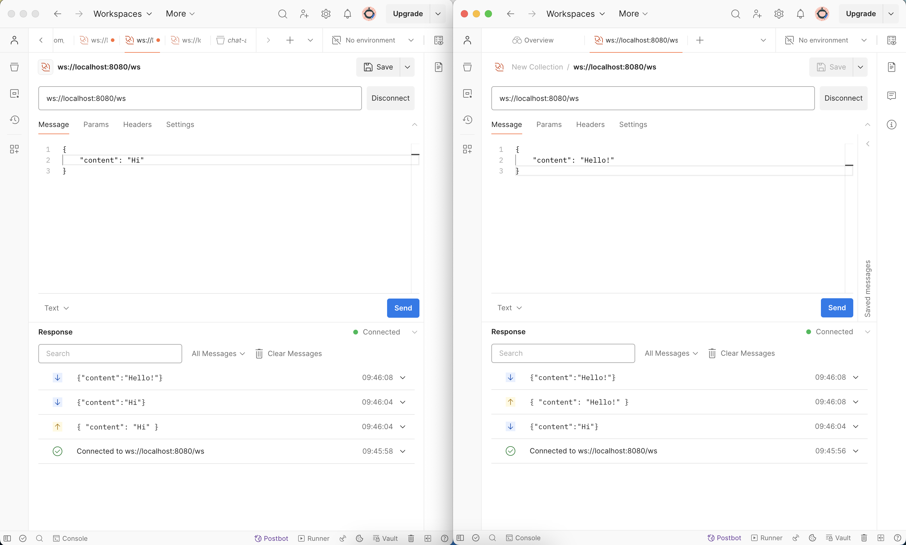

# gorilla/websocketのchat exampleを理解する

websocketを学習中に[`gorilla/websocket`](https://github.com/gorilla/websocket)にあるchatの実装例をみて勉強しようと思いましたが、さっぱりでした。。
websocketのロジック以外にも、通信確認や`switch`やら色々盛りだくさんで肝心のwebsocketがどのように実装されているかが、初学者の自分には汲み取ることができませんでした。。
色々調べながらなんとか理解できてきたので、今回はソースコードのうちwebsocketのロジック部分だけを抽出して動きを確かめてみます！


:::message
`gorilla/websocket`のサンプルコードから省略した箇所が不要というわけではないです！
:::

## 各ファイルの役割

websocketを担う`main.go`、`hub.go`、`client.go`はざっくりそれぞれ以下の役割となっています。

### `main.go`

- hubの作成と起動
- サーバーの起動

### `hub.go`

- `newHub()` : Hub構造体の作成
- `run()` : clientからの信号を受信し、clientの登録や削除、clientから届いたmessageのブロードキャストを実施

### `client.go`

- `readPump()` : clientの接続管理とclientが作成したmessageをhubに送信
- `writePump()` : hubからブロードキャストされたmessageを受信
- `serveWs()` : httpからwebsocketへのアップグレード、clientの新規作成

## 以下コードの注意点

今回は自分で理解しやすいよう、`gorilla/websocket`のサンプルコードを以下のように変更して引用しました。

- フロントエンドを使わず[postman](https://www.postman.com/)での接続確認に留めた
- 説明の都合上`main.go`、`hub.go`、`client.go`を1ファイルにまとめた
- Message構造体を用意し、messageをbyteからJSONでの送受信に簡素化した
- `client.go`内の一部命名がわかりにくかったので変更した
    - `Client.send` → `Client.recieve`
    - `readPump()` → `serveMessage()`
    - `writePump()` → `listenMessage()`

以降は基本的に、コードにコメントする形で解説を加えていきます。

## `main.go`

`main.go`をシンプルに`main()`にまとめると、以下のようになりました。また、以降で使用する`Message`構造体も定義しておきます。

```go

// contentのみのシンプルなMessage構造体を定義
type Message struct {
	Content string `json:"content"`
}

func main() {
	// hubを新規作成
	hub := newHab()
	// hubをgoroutineで起動
	go hub.run()
	// webサーバーを起動
	http.HandleFunc("/ws", func(w http.ResponseWriter, r *http.Request) {
		serveWs(hub, w, r)
	})

	http.ListenAndServe(":8080", nil)
}

```

このように`main()`ではhubを操作しているので、次は`hub.go`について見てみます。

## `hub.go`

`hub.go`内のコードは以下のようにまとめてみました。

```go

// Hub構造体の定義
type Hub struct {
	clients    map[*Client]bool // アクセス中のclientを管理
	broadcast  chan Message     // Messageをブロードキャストするためのchannel
	register   chan *Client     // clientのアクセスを検知するためのchannel
	unregister chan *Client     // clientの切断を検知するためのchannel
}

// Hubを新規作成
func newHab() *Hub {
	return &Hub{
		broadcast:  make(chan Message),
		register:   make(chan *Client),
		unregister: make(chan *Client),
		clients:    make(map[*Client]bool),
	}
}

// Hubを起動
func (h *Hub) run() {
	for {
		select {
		// アクセスのあったclientを追加
		case client := <-h.register:
			h.clients[client] = true
		// アクセスの切れたclientを削除
		case client := <-h.unregister:
			if _, ok := h.clients[client]; ok {
				delete(h.clients, client)
				close(client.receive)
			}
		// clientからのmessageをclients全員にブロードキャスト
		case message := <-h.broadcast:
			for client := range h.clients {
				select {
				// clientのreceiveチャンネルが開いていれば送信
				case client.receive <- message:
				// clientのreceiveチャンネルがブロックされていれば切断
				default:
					close(client.receive)
					delete(h.clients, client)
				}
			}
		}
	}
}

```

このようにhubでは、clientからの受信やclientへのブロードキャスト、そしてclientの管理を実施しています。

## `client.go`

最後に`client.go`のコードは以下のようにまとめてみました。個人的には一部命名を変えてmessageの形式をJSONにすることで、コード自体はスッキリして理解しやすくなったと思っています。

```go

// Client構造体の定義
type Client struct {
	hub     *Hub            // clientの所属するhub
	conn    *websocket.Conn // clientのコネクション
	receive chan Message    // hubからのmessageを受け取るchannel
}

func (c *Client) serveMessage() {
	// 接続が切れたらclientを削除
	defer func() {
		c.hub.unregister <- c
		c.conn.Close()
	}()

	// clientからのmessageをbroadcastに送信
	for {
		var message Message
		err := c.conn.ReadJSON(&message)
		if err != nil {
			break
		}
		c.hub.broadcast <- message
	}
}

func (c *Client) listenMessage() {
	defer c.conn.Close()

	// hubからブロードキャストされたmessageをreceive channelを通してclientに送信
	for {
		select {
		case message, ok := <-c.receive:
			if !ok {
				return
			}

			err := c.conn.WriteJSON(message)
			if err != nil {
				return
			}
		}
	}
}

func serveWs(hub *Hub, w http.ResponseWriter, r *http.Request) {
	// HTTP接続をWebSocket接続にアップグレード
	conn, err := upgrader.Upgrade(w, r, nil)
	if err != nil {
		return
	}
	// clientを作成
	client := &Client{
		hub:     hub,
		conn:    conn,
		receive: make(chan Message),
	}

	// clientをhubに登録
	client.hub.register <- client

	// clientとhubの通信をgoroutineで開始
	go client.listenMessage()
	go client.serveMessage()
}
```

このようにclient側では、messageを送信する関数と受信する関数をそれぞれgoroutineで起動していることがわかります。

## Postmanによる接続確認

ターミナルから`main.go`を起動してpostmanのwindowを2つ開き、それぞれで`ws://localhost:8080/ws`へアクセスしてみます。

以下のようにそれぞれのwindowで異なるmessageを送信し、お互いのwindowにmessageが受信されていることが確認できました。



## まとめ

今回は`gorilla/websocket`のchatサンプルコードを噛み砕いてwebsocketの実装に焦点を絞ってみました。

websocketを実際に実装するときはサンプルにあるような接続確認なども、もちろん必要だと思います。ですので、今回の記事でwebsocketの実装について理解ができれば、元のソースコードも動かしてみるとより理解が深まるかと思います。